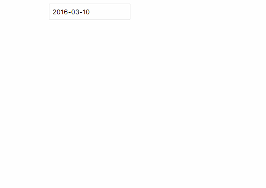

#Vue-datepicker

vue选择日期的组件，可以设置可选范围，可以设置不可选日期

#预览

#参数

- isPicker: 是否展示
- x: 横坐标
- y: 纵坐标
- begin: 开始日期
- end: 结束日期
- disables: 不可选择日期
- theday: 默认选中日期

#示例

    <template>
      <input v-model="theday" @click.stop="showDatepicker" type="text" readonly="readonly" style="position:relative;left:300px;top:40px;">
      <datepicker :is-picker.sync="isPicker" :x="x" :y="y" :theday.sync="theday" :begin="begin" :end="end" :disables="disables"></datepicker>
    </template>

    